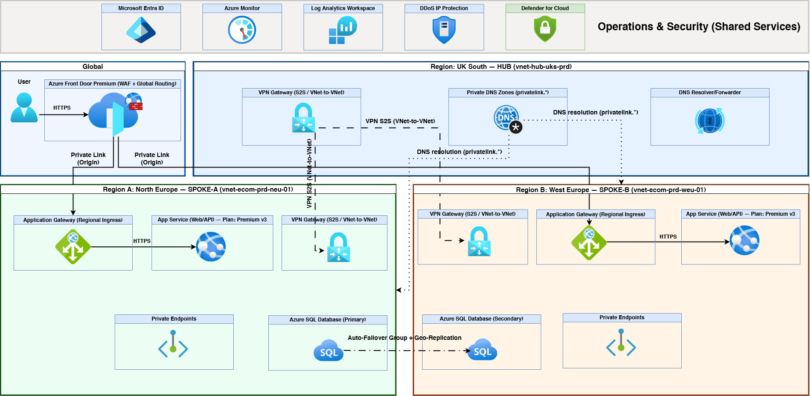
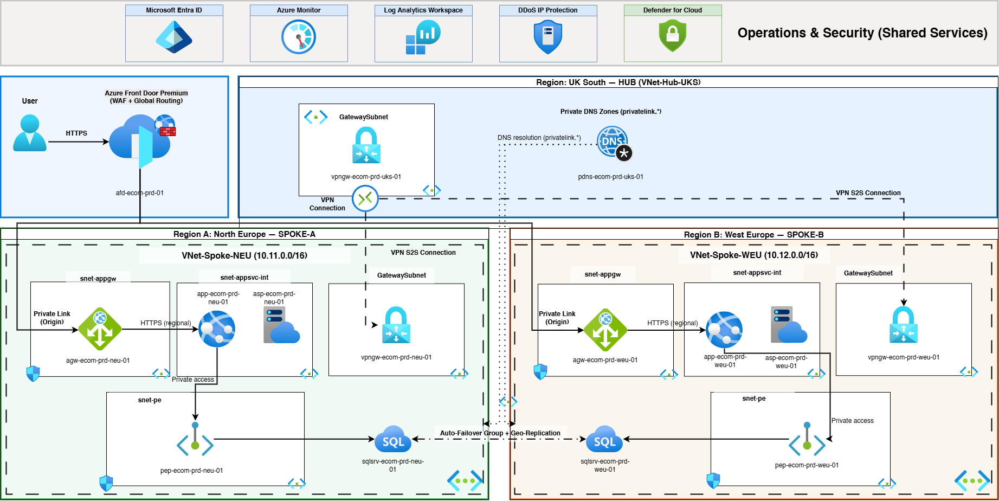

# NileRetail Group — Azure Multi‑Region Production + DR (Hub & Spoke over VPN S2S)

> **Goal:** Build a **highly available, multi‑region** Azure platform for an e‑commerce mobile/web workload using **Hub & Spoke**, **private connectivity**, and a **DR-ready** data layer.

---

## Project context

This repository contains a portfolio-grade Azure architecture project completed as part of the **GBG internship graduation project**.

The business scenario is based on a fictional company, **NileRetail Group**, created for educational and portfolio purposes only.  
All company branding, architecture decisions, and documentation were prepared to simulate a realistic enterprise cloud design exercise.  
This is personal portfolio work — it uses no proprietary or confidential information belonging to GBG.

---

## What this repo showcases

- **Global entry** via **Azure Front Door Premium (WAF)** with **private origin** connectivity.
- **Multi‑region workload** in **North Europe (Primary)** + **West Europe (Secondary)**.
- **Hub & Spoke networking** with **VPN S2S (VNet-to-VNet)** connectivity — IPSec/IKEv2 encrypted tunnels, transitive routing through hub, future on-premises ready.
- **Private access by design** using **Private Endpoints** + **Private DNS Zones**.
- **Database DR** using **Azure SQL Auto‑Failover Group** (cross‑region).
- **Operational readiness**: Azure Monitor + Log Analytics + Defender for Cloud + Entra ID (MFA/Conditional Access).

**Regions**
- **Hub:** UK South  
- **Spoke‑A (Primary):** North Europe  
- **Spoke‑B (Secondary/DR):** West Europe  

---

## Architecture diagrams

### High‑Level Design (HLD)

### Low‑Level Design (LLD)

---

## Key design decisions (the “why”)

Every major decision in this design has a technical reason behind it — not just a requirement. The reasoning below is a summary; each topic links to its full document.

---

### VPN S2S (VNet-to-VNet) instead of VNet peering

VNet Peering is simpler and cheaper — but it does not encrypt traffic at the packet level. It relies on Microsoft’s infrastructure isolation, which is not the same as auditable encryption.

VNet-to-VNet VPN uses **IKEv2 with AES-256-GCM end-to-end encryption** through each tunnel. For an e-commerce company handling customer payment data and personal information under GDPR, this is the stronger and more defensible security posture — you can point to the encryption standard, not just trust the platform.

Beyond encryption, VPN tunnels route through the hub VPN Gateway, meaning all cross-spoke traffic passes through the hub where **Azure Firewall** can inspect it. VNet Peering is not transitive — without a network virtual appliance, spoke-to-spoke traffic would bypass the hub firewall entirely. The hub VPN Gateway also positions the architecture for future **on-premises S2S connectivity** to NileRetail’s Egypt datacentre without any redesign.

→ Full trade-off analysis: [`docs/adr/0002-vpn-vnet2vnet-instead-of-peering.md`](docs/adr/0002-vpn-vnet2vnet-instead-of-peering.md)

---

### Front Door Premium + Private Link origin

With a public origin model, any attacker who discovers the Application Gateway’s public IP can reach it directly — bypassing Front Door, bypassing the WAF, and bypassing DDoS protection entirely. This is a real attack vector, not a theoretical one.

Private Link origin means **Front Door connects to the Application Gateway through Azure’s private backbone** — the Application Gateway never needs a publicly routable IP for this path. An attacker scanning the internet cannot reach the origin directly.

Front Door’s WAF runs at Microsoft’s **global edge PoPs** — threats are blocked before they ever reach the Azure region and consume bandwidth or compute. This is fundamentally more efficient than WAF only at the regional Application Gateway.

Front Door also handles **automatic failover** between North Europe (priority 1) and West Europe (priority 2) with health probes — if the primary region becomes unhealthy, traffic shifts to the secondary without any DNS change or manual action.

→ Full rationale: [`docs/adr/0001-private-origin-frontdoor.md`](docs/adr/0001-private-origin-frontdoor.md)

---

### Private Endpoints — no internet traversal for any backend service

Both Azure SQL and App Service have **public network access disabled**. There is no path from the public internet to either service — not through a firewall rule, not through a service endpoint, not at all.

Private Endpoints place a private NIC with a private IP directly inside the spoke VNet (`snet-pe`). When the application queries `sqlsrv-ecom-prd-neu-01.database.windows.net`, Private DNS resolves it to `10.11.2.x` — a private IP inside the VNet. The traffic never leaves the Azure network fabric.

This is the correct architecture for GDPR compliance: customer data in transit between application and database stays entirely within Azure’s private network, in EU regions, with no internet exposure at any point.

→ Full explanation: [`docs/02-security.md`](docs/02-security.md)

---

### DDoS IP Protection (not Network Protection)

Azure DDoS Network Protection costs approximately **$2,944/month** as a flat fee to protect an entire VNet. In this architecture, App Service and SQL have no public IPs (they’re accessed via Private Endpoints), so VNet-level protection is significantly over-scoped.

DDoS **IP Protection** protects specific public IP resources — in this design, the VPN Gateway public IPs and any intentionally public ingress IPs. Cost for 6 protected resources: approximately **$1,194/month**.

The saving is **$1,750/month** with equivalent protection for the actual public IP attack surface. Using Network Protection here would mean paying ~$1,750/month to protect IPs that don’t exist.

→ Cost breakdown: [`docs/06-costing.md`](docs/06-costing.md)

---

### Azure SQL Auto-Failover Group (not just geo-replication)

Active geo-replication alone continuously replicates the database to the secondary region — but it does not give you a stable connection endpoint. If North Europe fails and you manually promote the West Europe replica, your application’s connection string still points to `sqlsrv-ecom-prd-neu-01.database.windows.net`. The app breaks until someone updates the config.

The **Auto-Failover Group** wraps geo-replication with a single **listener FQDN**: `fog-ecom-prd-01.database.windows.net`. This endpoint always resolves to the current primary — before failover, during failover, and after failover. The application never needs to change its connection string. Failover is completely transparent.

Target **RPO: < 5 seconds** (async replication lag). Target **RTO: < 5 minutes** (failover command + DNS propagation).

→ Full data platform design: [`docs/04-data-platform.md`](docs/04-data-platform.md)

---

### Microsoft Defender for Cloud

Defender for Cloud provides two things this project uses: **CSPM** (Cloud Security Posture Management) and **Workload Protection**.

CSPM continuously scans the entire subscription for misconfigurations — things like SQL servers with public access accidentally re-enabled, overly permissive RBAC assignments, or missing diagnostic settings. It produces a **Secure Score** and a prioritised remediation list. This matters because cloud misconfigurations, not sophisticated attacks, are the cause of most cloud security incidents.

Workload Protection plans are enabled for **App Service** and **Azure SQL** — the two services that handle customer data. Defender for SQL specifically detects SQL injection attempts at the database layer. Even with WAF blocking SQL injection at the edge, defence-in-depth means you want anomaly detection at the data tier as well.

→ Full security design: [`docs/02-security.md`](docs/02-security.md)

---

## Documentation index

| # | Document | What it covers | Link |
|---|----------|----------------|------|
| 00 | Assumptions & scope | Project boundaries, in-scope / out-of-scope | [`docs/00-assumptions.md`](docs/00-assumptions.md) |
| 00 | Naming conventions | Resource type codes, region codes, tag policy | [`docs/00-naming-conventions.md`](docs/00-naming-conventions.md) |
| 01 | Network design | VNets, subnets, CIDRs, VPN, routing, DNS | [`docs/01-network-design.md`](docs/01-network-design.md) |
| 02 | Security design | WAF, DDoS, Private Link, Entra ID, Defender | [`docs/02-security.md`](docs/02-security.md) |
| 03 | App platform | App Gateway, App Service, VNet integration | [`docs/03-app-platform.md`](docs/03-app-platform.md) |
| 04 | Data platform | Azure SQL, failover group, private connectivity | [`docs/04-data-platform.md`](docs/04-data-platform.md) |
| 05 | Operations | Log Analytics, alerts, KQL queries, dashboards | [`docs/05-operations.md`](docs/05-operations.md) |
| 06 | Costing | Full cost breakdown, RI savings, optimisation | [`docs/06-costing.md`](docs/06-costing.md) |
| 07 | Project plan | 5-phase plan, tasks, dates, status | [`docs/07-project-plan.md`](docs/07-project-plan.md) |
| 08 | Implementation guide | Phase-by-phase CLI build guide with verify steps | [`docs/08-implementation-guide.md`](docs/08-implementation-guide.md) |
| — | Architecture decisions (ADRs) | Why Front Door private origin; why VPN over peering | [`docs/adr/`](docs/adr/) |
| — | Runbooks | DR failover procedure, DNS troubleshooting | [`docs/runbooks/`](docs/runbooks/) |
| — | NSG rules checklist | Port matrix per subnet, mandatory rules | [`docs/checklists/nsg-rules.md`](docs/checklists/nsg-rules.md) |
| — | References | Official Microsoft Learn links for all patterns used | [`docs/99-references.md`](docs/99-references.md) |

---

## Project documents

| Folder | Contents |
|--------|----------|
| [`sow/`](sow/) | Scope of Work (v2.0) — formal engagement document |
| [`cost/`](cost/) | Azure Pricing Calculator export — PAYG and RI estimates |
| [`project-plan/`](project-plan/) | 5-phase project plan with tasks and status |
| [`presentation/`](presentation/) | Walk-through deck for stakeholder review |
| [`diagrams/`](diagrams/) | HLD and LLD architecture diagrams (PNG) |

---

## Repo contents

| Folder / File | Type | What's inside |
|---------------|------|----------------|
| [`diagrams/`](diagrams/) | 📐 Architecture | HLD and LLD exports (PNG) |
| [`docs/`](docs/) | 📄 Documentation | Network, security, app, data, ops, costing, project plan, implementation guide, ADRs, runbooks, checklists |
| [`iac/bicep/`](iac/bicep/) | 🔧 IaC | Deployable Bicep modules — hub, spoke, private DNS, VPN connections, SQL failover group, Front Door |
| [`iac/bicep/modules/`](iac/bicep/modules/) | 🔧 IaC | Reusable child modules — sql-server, sql-private-endpoint |
| [`scripts/`](scripts/) | ⚙️ Scripts | DNS and connectivity validation script (`validate-dns.sh`) |
| [`sow/`](sow/) | 📋 Engagement | Scope of Work document (CloudScale Solutions → NileRetail Group, v2.0) |
| [`cost/`](cost/) | 💰 Costing | Azure Pricing Calculator export — PAYG, 1-year RI, 3-year RI estimates |
| [`project-plan/`](project-plan/) | 📅 Planning | 5-phase project plan with tasks, owners, dates, and status |
| [`presentation/`](presentation/) | 🎞️ Presentation | Walk-through deck for stakeholder review |

---

## How to use this repo

| Step | What to do | Where to start |
|------|------------|----------------|
| 1 | Understand the big picture | [`diagrams/HLD.png`](diagrams/HLD.png) |
| 2 | Understand the detail | [`diagrams/LLD.png`](diagrams/LLD.png) |
| 3 | Read the network and security design | [`docs/01-network-design.md`](docs/01-network-design.md) → [`docs/02-security.md`](docs/02-security.md) |
| 4 | Follow the build | [`docs/08-implementation-guide.md`](docs/08-implementation-guide.md) |
| 5 | Deploy the IaC | [`iac/bicep/`](iac/bicep/) — start with `hub.bicep` |
| 6 | Validate | [`scripts/validate-dns.sh`](scripts/validate-dns.sh) |
| 7 | Review costs and plan | [`docs/06-costing.md`](docs/06-costing.md) · [`docs/07-project-plan.md`](docs/07-project-plan.md) |

---

## Costing snapshot

| Pricing model | Estimated monthly cost |
|---------------|----------------------|
| Pay-As-You-Go (PAYG) | **$6,931.53** |
| 1-Year Reserved Instances | **$6,342.29** *(~8.5% saving)* |
| 3-Year Reserved Instances | **$6,005.56** *(~13.4% saving)* |

Pricing snapshot date: **2026-01-09** · Licensing: Microsoft Online Services Agreement (MOSA).  
See [`docs/06-costing.md`](docs/06-costing.md) for the full breakdown and [`cost/`](cost/) for the raw calculator export.

---

## Disclaimer

The architecture patterns in this project are real and aligned with practical Azure implementations.  
All company names, identifiers, and scenario details are fictional and for portfolio purposes only.  
See [Project context](#project-context) above.

---

## References
See [`docs/99-references.md`](docs/99-references.md) for Microsoft Learn links + key patterns used.